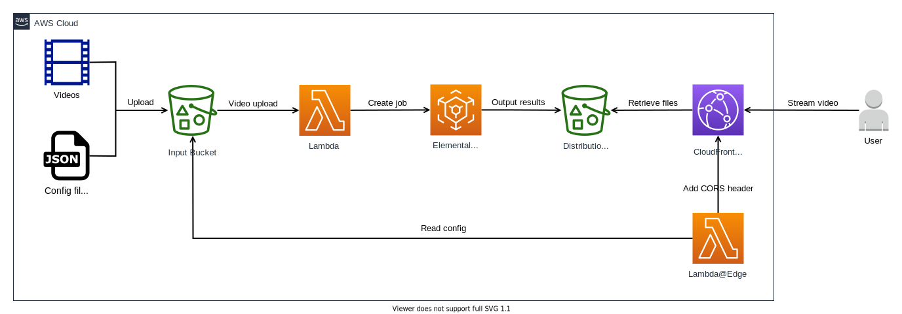

# video-host

Video hosting for multiple projects & origins using AWS Elemental MediaConvert, CloudFront, and Lambda.



## Requirements

- [AWS Serverless Application Module (SAM)](https://aws.amazon.com/serverless/sam/)
- [esbuild](https://github.com/evanw/esbuild)


## Usage

To add videos, upload them to the `input` bucket in `/input/PROJECT_NAME/video.mp4` where `PROJECT_NAME` is the name of the project

To configure a project's allowed CORS origins, upload a file named `config.json` to the `input` bucket with the following structure:

```json
{ "PROJECT_NAME": { "allowedOrigins": ["https://www.example1.com", "https://www.example2.com"] } }
```

### Example

```
export INPUT_BUCKET="video-host-us-east-1-123456789012-input"
aws s3 cp test/files/config.json s3://$INPUT_BUCKET/config.json
aws s3 cp test/files/input/test/beach.mp4 s3://$INPUT_BUCKET/input/test/beach.mp4
```

Then stream the video with [video.js](https://github.com/videojs/video.js): [link](https://eresearchqut.github.io/video-host/test/index.html)

## Test

```
sam validate
sam build
sam local invoke UploadFunction --event test/events/upload.json -n test/env/upload.json --region us-east-1
```

## Deploy

```
export SAM_BUCKET_NAME="aws-sam-cli-managed-default-samclisourcebucket-abcdefghijlm"
export SAM_PREFIX="video-host"
```

```
sam validate
sam build
sam deploy --s3-bucket $SAM_BUCKET_NAME --s3-prefix $SAM_PREFIX
```